# docs/PROJECT_OVERVIEW.md

**Come funziona?**

1.  **Due Percorsi, un Unico Arrivo**: Che sia un agente a vincere una trattativa (Push) o un cliente a chiamare (Pull), entrambi i percorsi convergono nella creazione di un **`Ordine`**. Questo ci dà una visione unificata del fatturato e delle vendite, indipendentemente da come sono nate.
2.  **Lo Storico Unificato (La "Card-Persona")**: Introduciamo il concetto di **`Interazione`**. Ogni volta che succede qualcosa di rilevante con un cliente (un'email, una telefonata, una visita, un ordine e-commerce, una lamentela), lo registriamo come una `Interazione`. L'insieme di tutte le interazioni crea lo storico completo del cliente, la sua "Card-Persona", dando all'agente un vantaggio strategico enorme.
3.  **Funnel più Intelligente**: Abbiamo reso il percorso di vendita (`Lead`) più dettagliato, aggiungendo la gestione delle `Proposte` multiple e nuovi stati. Questo ci permette di analizzare con più precisione dove si bloccano le trattative e perché.

Questa architettura ci permette di rispondere a domande complesse come: "Quali clienti che hanno comprato il prodotto X online hanno anche ricevuto una visita da un agente negli ultimi 3 mesi?". È questo il livello di intelligenza che vogliamo raggiungere.


## Visione: Da CRM a Hub di Intelligenza del Cliente

NEXUS-CRM è progettato per diventare il sistema nervoso centrale di tutte le interazioni con i clienti di TSvapo. L'obiettivo è fornire una visione a 360 gradi, tracciando ogni punto di contatto per trasformare i dati in strategie di vendita vincenti.

Il sistema gestirà in modo integrato due flussi operativi fondamentali:
1.  **Flusso "Push" (Vendita Proattiva):** Supporta gli agenti commerciali nel loro lavoro di sviluppo di nuove opportunità, dalla creazione di un "lead" fino alla chiusura della trattativa, attraverso un percorso di vendita (pipeline) strutturato.
2.  **Flusso "Pull" (Vendita Reattiva):** Permette di gestire in modo efficiente gli ordini che arrivano direttamente dai clienti, sia storici che nuovi, che contattano l'azienda di loro iniziativa.

Entrambi i flussi convergono in un sistema di gestione ordini unificato, garantendo una visione completa e coerente del business.

## Architettura dei Moduli Funzionali

* **Modulo 0: Sicurezza & Accessi (Completato):** Garantisce che ogni utente acceda in modo sicuro solo alle proprie informazioni.
* **Modulo 1: CRM Core (Completato):** Permette la gestione dell'anagrafica di contatti, delle trattative (Lead) e del ciclo di vita degli ordini.
* **Modulo 2: Analytics & Dashboard (In Corso):** Trasformerà i dati raccolti in grafici e indicatori (KPI) per monitorare le performance.
* **Modulo 3: Ottimizzazione Percorsi (Pianificato):** Integrerà lo strumento per pianificare in modo efficiente i giri di visite.
* **Modulo 4: Marketing & Comunicazione (Pianificato):** In futuro, gestirà l'invio di newsletter e comunicazioni, tracciando ogni interazione.
```

-----

#### **2. Sezione Tecnica (Diagrammi e Architettura)**
````markdown
# 🧱 Sezione Tecnica Completa – NEXUS-CRM

## 1. Architettura Generale (Diagramma dei Componenti)

Questo diagramma illustra l'interazione tra i componenti principali del sistema e i flussi di dati.

```mermaid
graph TD
    subgraph "Infrastruttura Cloud (Hetzner)"
        subgraph "Docker Environment"
            A[Frontend - SvelteKit] -->|API Calls (HTTPS)| B{NEXUS-CRM Core API (FastAPI)};
            B --> C[DB Operativo (PostgreSQL)];
            B --> D[Microservizio Percorsi];
        end
    end

    subgraph "Punti di Contatto (Inputs)"
      U[Azione Agente (Push)] --> B;
      P[Chiamata Cliente (Pull)] --> B;
      W[Ordine E-commerce (Pull)] --> B;
    end

    subgraph "Servizi Esterni (per Analisi)"
        F[TSvapo E-commerce DB]
        G[Google Analytics]
        H[SerpBear]
    end

    subgraph "Data Analytics Layer (Futuro)"
        J[Data Warehouse]
    end

    C -->|ETL| J;
    F -->|ETL| J;
    G -->|API| J;
    H -->|API| J;

    style B fill:#ccf,stroke:#333,stroke-width:2px
    style C fill:#9f9,stroke:#333,stroke-width:2px
    style J fill:#f99,stroke:#333,stroke-width:2px
````


## 2\. Mappe dei Processi di Business (BPMN)

### Processo 1: Sales Pipeline (Flusso PUSH)

```mermaid
graph TD
    A(Inizio: Nuovo Lead) --> B[Contatto Iniziale];
    B --> C{Qualificato?};
    C -- No --> D[Archivia Lead (Lost)];
    C -- Sì --> E[Invio Proposta];
    E --> F{Negoziazione};
    F -- Accettata --> G[Lead Vinto];
    F -- Rifiutata --> D;
    G --> H((Crea Record 'Order'));
    D --> Z(Fine);
    H --> Z;
```

### Processo 2: Ordine Diretto (Flusso PULL)

```mermaid
graph TD
    A(Inizio: Cliente Chiama) --> B[Crea Record 'Order'];
    B --> C{Ordine necessita Approvazione?};
    C -- Sì --> D[Ciclo di Approvazione];
    C -- No --> E[Ordine Approvato];
    D --> E;
    E --> F[Processa e Spedisci];
    F --> Z(Fine);
```



````
